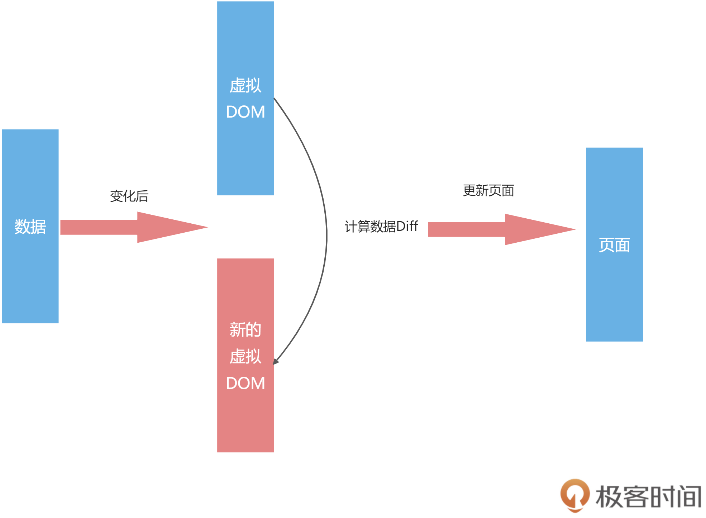

## angularjs
1. Angular 1 就是最老套的脏检查。所谓的脏检查，指的是 Angular 1 在对数据变化的检查上，遵循每次用户交互时都检查一次数据是否变化，有变化就去更新 DOM 这一方法
2. angular2 完全抛弃 Angular 1，搞了一个全新的框架还叫 Angular，引入了 TypeScript、RxJS 等新内容，虽然这些设计很优秀，但是不支持向前兼容
## vue1
1. 响应式
2. Vue1 和 React 在数据发生变化后，在通知页面更新的方式上有明显的不同
3. 在 Vue 框架下，如果数据变了，那框架会主动告诉你修改了哪些数据；
缺点： 对于 Vue1 来说，它的一个核心就是“响应式”，也就是数据变化后，会主动通知我们。响应式数据新建 Watcher 监听，本身就比较损耗性能，项目大了之后每个数据都有一个 watcher 会影响性能

## vue2
1. Vue 2引入虚拟 DOM 来解决响应式数据过多的问题
2. 使用虚拟 DOM 解决了响应式数据过多的内存占用问题，又良好地规避了 React 中虚拟 DOM 的问题， 还通过虚拟 DOM 给 Vue 带来了跨端的能力
3. 响应式数据是主动推送变化，虚拟 DOM 是被动计算数据的 Diff，一个推一个拉，它们看起来是两个方向的技术，但被 Vue 2 很好地融合在一起，采用的方式就是组件级别的划分。
4. 对于 Vue 2 来说，组件之间的变化，可以通过响应式来通知更新。组件内部的数据变化，则通过虚拟 DOM 去更新页面。这样就把响应式的监听器，控制在了组件级别，而虚拟 DOM 的量级，也控制在了组件的大小
5. 组件内部是没有 Watcher 监听器的，而是通过虚拟 DOM 来更新，每个组件对应一个监听器，大大减小了监听器的数量
- Vue 的世界默认是 template，也就是语法是限定死的，比如 v-if 和 v-for 等语法
- Vue 3 很优秀的一个点，就是在虚拟 DOM 的静态标记上做到了极致，让静态的部分越过虚拟 DOM 的计算，真正做到了按需更新，很好的提高了性能。


## MVVM
就是在前端的场景下，把 Controller 变成了 View-Model 层，作为 Model 和 View 的桥梁，Model 数据层和 View 视图层交给 View-Model 来同步

## react中的虚拟 DOM

```HTML

<div id = "app">
    <p class = "item">Item1</p>
    <div class = "item">Item2</div>
</div>
```
- 在 React 中，这样一段 HTML 会被映射成一个 JavaScript 的对象进行描述。这个对象就像数据和实际 DOM 的一个缓存层，通过管理这个对象的变化，来减少对实际 DOM 的操作  
- 这种形式不仅让性能有个很好的保障，我们还多了一个用 JSON 来描述网页的工具，并且让虚拟 DOM 这个技术脱离了 Web 的限制
虚拟 DOM 在运行的时候就是这么一个对象：
```JS

{
  tag: "div",
  attrs: {
    id: "app"
  },
  children: [
    {
      tag: "p",
      attrs: { className: "item" },
      children: ["Item1"]
    },
    {
      tag: "div",
      attrs: { className: "item" },
      children: ["Item2"]
    }
  ]
}

```

- 这个对象完整地描述了 DOM 的树形结构，这样数据有变化的时候，我们生成一份新的虚拟 DOM 数据，然后再对之前的虚拟 DOM 进行计算，算出需要修改的 DOM，再去页面进行操作
- 浏览器操作 DOM 一直都是性能杀手，而虚拟 DOM 的 Diff 的逻辑，又能够确保尽可能少的操作 DOM，这也是虚拟 DOM 驱动的框架性能一直比较优秀的原因之一
- Vue 和 React 在数据发生变化后，在通知页面更新的方式上有明显的不同
- React 的数据变化后，我们只能通过新老数据的计算 Diff 来得知数据的变化

缺点：对于 React 的虚拟 DOM 的 Diff 计算逻辑来说，如果虚拟 DOM 树过于庞大，使得计算时间大于 16.6ms，那么就可能会造成性能的卡顿

解决方案
React 为了突破性能瓶颈，借鉴了操作系统时间分片的概念，引入了 Fiber 架构。  
通俗来说，就是把整个虚拟 DOM 树微观化，变成链表，然后我们利用浏览器的空闲时间计算 Diff。  
一旦浏览器有需求，我们可以把没计算完的任务放在一旁，把主进程控制权还给浏览器，等待浏览器下次空闲  

- React 的世界里只有 JSX，最终 JSX 都会在 Compiler 那一层，也就是工程化那里编译成 JS 来执行，所以 React 最终拥有了全部 JS 的动态性，这也导致了 React 的 API 一直很少，只有 state、hooks、Component 几个概念，主要都是 JavaScript 本身的语法和特性。