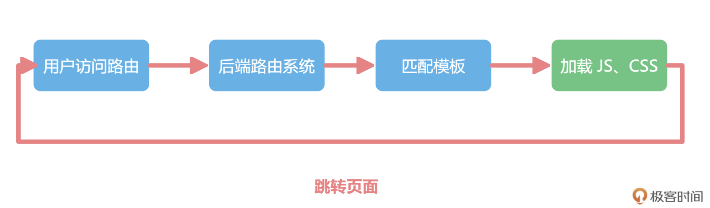

## 项目启动的骨架
- 目录中的 index.html 是项目的入口；
- package.json 是管理项目依赖和配置的文件；
- public 目录放置静态资源，比如 logo 等图片；
- vite.config.js 就是和 Vite 相关所有工程化的配置；
- src 就是工作的重点，我们大部分的代码都会在 src 目录下管理和书写
```JS

├── README.md
├── index.html           入口文件
├── package.json
├── public               资源文件
│   └── favicon.ico
├── src                  源码
│   ├── App.vue          单文件组件
│   ├── assets
│   │   └── logo.png
│   ├── components   
│   │   └── HelloWorld.vue
│   └── main.js          入口
└── vite.config.js vite工程化配置文件
```
## 体系
- 我们所有工程化体系都是基于 Node.js 生态；
- 我们使用 VS Code+Volar 编辑器 + 语法提示工具作为上层开发工具；
- 使用 Vite 作为工程化工具；使用 Chrome 进行调试，这些都是 Vue 3 工程化体系的必备工具

## 必备

vue-router 和 Vuex 也成为了必选项，就像一个团队需要人员配比，Vue 负责核心，Vuex 负责管理数据，vue-router 负责管理路由

## src 目录的组织结构

```JS

├── src
│   ├── api            数据请求
│   ├── assets         静态资源
│   ├── components     组件
│   ├── pages          页面
│   ├── router         路由配置
│   ├── store          vuex数据
│   └── utils          工具函数

```
- 引入了 createRouter 和 createWebHashHistory 两个函数。c
- reateRouter 用来新建路由实例， createWebHashHistory 用来配置我们内部使用 hash 模式的路由，也就是 url 上会通过 # 来区分
- Vue 中单文件组件的写法，我们可以在一个文件中通过 template、script 和 style 来维护 Vue 组件的 HTML、JavaScript 和 CSS
- router-link 负责跳转不同的页面，相当于 Vue 世界中的超链接 a 标签
- router-view 负责渲染路由匹配的组件，我们可以通过把 router-view 放在不同的地方，实现复杂项目的页面布局
- CSS 代码时，我们需要预处理工具 stylus 或者 sass
- 组件库开发中，我们需要 Element3 作为组件库
- 网络请求后端数据的时候，我们需要 Axios。
- 代码规范。我们需要 Eslint 和 Prettier 来规范代码的格式，Eslint 和 Prettier 可以规范项目中 JavaScript 代码的可读性和一致性
- 代码的管理还需要使用 Git，我们默认使用 GitHub 来托管我们的代码。此外，我们还会使用 commitizen 来规范 Git 的日志信息
- 对于我们项目的基础组件，我们还会提供单元测试来确保代码质量和可维护性，最后我们还会配置 GitHub Action 来实现自动化的部署

###  Composition API 
 1. 使用 ref 包裹响应式数据，并在参数里初始化.
 2. 在你修改 title 和 todos 的时候，注意要修改响应式数据的 value 属性
 3. 在 Composition API 的语法中，计算属性和生命周期等功能，都可以脱离 Vue 的组件机制单独使用
 - 因为 ref 和 computed 等功能都可以从 Vue 中全局引入，所以我们就可以把组件进行任意颗粒度的拆分和组合
 - 使用 `<script setup>`少了两层嵌套。并且，我们还要在 setup 函数中，返回所有需要在模板中使用的变量和方法
 - 使用 `<script setup>` 可以让代码变得更加精简，这也是现在开发 Vue 3 项目必备的写法
 - style 样式的特性，加上 scoped 这个属性的时候，我们定义的 CSS 就只会应用到当前组件的元素上
 - 如果在 scoped 内部，你还想写全局的样式，那么你可以用:global 来标记，这样能确保你可以很灵活地组合你的样式代码
 - 通过 v-bind 函数来使用 JavaScript 中的变量去渲染样式，如果这个变量是响应式数据，就可以很方便地实现样式的切换
 - 所有的功能都是通过全局引入的方式使用的，并且通过 `<script setup>` 的功能，我们定义的变量、函数和引入的组件，都不需要额外的生命周期，就可以直接在模板中使用

 ### 三种实现原理的对比表格如下，帮助你理解三种响应式的区别
 
 - 可以把一切项目中的状态和数据都封装成响应式的接口，屏蔽了浏览器的 API，对外暴露的就是普通的数据
 - 我们可以把网络状态、异步请求的数据、动画和事件等功能，都看成是响应式的数据去管理
 - VueUse 提供了一大批工具函数，包括全屏、网络请求、动画等，都可以使用响应式风格的接口去使用，并且同时兼容 Vue 2 和 Vue 3，开箱即用

### 组件和外部数据之间的同步
 

 ### vuex数据管理
 
1. Vue 的组件负责渲染页面，组件中用到跨页面的数据，就是用 state 来存储，但是 Vue 不能直接修改 state，而是要通过 actions/mutations 去做数据的修改。
 

 ### 路由系统
 jQuery 时代  
 

  现代路由
  用户访问路由后，无论是什么 URL 地址，都直接渲染一个前端的入口文件 index.html，然后就会在 index.html 文件中加载 JS 和 CSS。之后，JavaScript 获取当前的页面地址，以及当前路由匹配的组件，再去动态渲染当前页面即可。用户在页面上进行点击操作时，也不需要刷新页面，而是直接通过 JS 重新计算出匹配的路由渲染即可  
 
  ### SPA
  - 这种所有路由都渲染一个前端入口文件的方式，是单页面应用程序（SPA，single page application）应用的雏形
  - 通过 JavaScript 动态控制数据去提高用户体验的方式并不新奇，Ajax 让数据的获取不需要刷新页面，SPA 应用让路由跳转也不需要刷新页面

  通过 URL 区分路由的机制上，有两种实现方式，
  - 一种是 hash 模式，通过 URL 中 # 后面的内容做区分，我们称之为 hash-router；
  - 另外一个方式就是 history 模式，在这种方式下，路由看起来和正常的 URL 完全一致。
  - 这两个不同的原理，在 vue-router 中对应两个函数，分别是 createWebHashHistory 和 createWebHistory。  
   