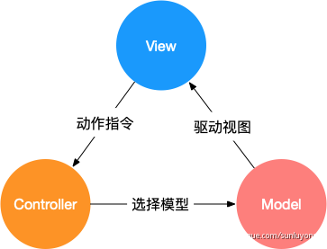
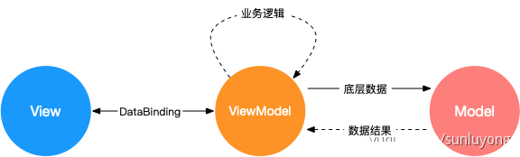

## 设计模式
##站在巨人的肩膀
[MVC、MVP、MVVM](https://www.yuque.com/sunluyong/node/mvc)
[JavaScript 设计模式学习第二十六篇－ MVC、MVP、MVVM 模式](https://cloud.tencent.com/developer/article/1753414)
[简单理解 MVC、MVP、MVVM](https://zhuanlan.zhihu.com/p/165572019)
- MVC : Model - View - Controller
- MVP : Model - View - Presenter
- MVVM: Model - View - View Model
## 简单例子
页面有一个 id 为 `container` 的 `span`，点击按钮会让其内容加 1
```HTML
<div>
	<span id="container">0</span>
  <button id="btn" onclick="javascript:add()">+</button>
</div>

<script>
  function add (){
    const container = document.getElementById('container');
    const current = parseInt(container.innerText);
    container.innerText = current + 1;
  }
</script>
```
视图渲染和数据处理的逻辑杂糅在一起，随着业务逻辑变复杂，代码将失控，难以维护
## MVC
- Model：模型层，数据相关的操作
- View：视图层，用户界面渲染逻辑
- Controller：控制器，数据模型和视图之间通信的桥梁.它直接面对User，接受用户操作。然后把用户提供的数据或者操作（view）传递给具体的Model，Model再把最终的结果展示在View层。一旦UI上触发事件操作，Controller再次接受输入，如此循环......Controller是View和Model之间的协调者


MVC 模型把视图渲染和数据处理做了隔离，通过控制器接收 View 操作，传递给数据模型，数据 ready 后由数据模型驱动视图渲染  


MVC 模式来写可以做简单的代码分离
view  
```HTML
<div>
	<span id="container">0</span>
  <button id="btn">+</button>
</div>
```
controller
```JS
const button = document.getElementById('btn');
// 响应视图指令
button.addEventListener('click', () => {
  const container = document.getElementById('container');
  
  // 调用模型
	add(container);
}, false);

```
model
```JS
function add (node) {
  // 业务逻辑处理
  const currentValue = parseInt(node.innerText);
  const newValue = currentValue + 1;
  
  // 更新视图
	node.innerText = newValue + 1;
}

```
优点：
1. 视图层最简单，处理页面的渲染
2. 模型层定义了 +1 操作的实现，并更新视图数据
3. 控制器在用户点击按钮的时候把请求转发给模型处理，在 web 开发中一般页面、接口请求的路由也是控制器负责。

缺点：
1. Controller 获取了 container 节点，做为参数传给了 Model，这样 Controller 需要理解 View，也就是和 View 的实现还是存在耦合
2. 在 MVC 的实践中相当程度的业务逻辑实际会被写在 Controller 中，因为 Controller 被定位为 View 的 Model 沟通的桥梁，这部分耦合可以接受
3. 因为 View 的更新由 Model 处理，所以 Model 难免要和 View 的实现耦合，可以使用观察者模式让 View 监听 Mode 的数据变化做出更新，但这样 View 的实现又依赖的 Model

## MVP
- Model：和具体业务无关的数据处理
- View：用户界面渲染逻辑
- Presenter：响应视图指令，同时进行相关业务处理，必要时候获调用 Model 获取底层数据，返回指令结果到视图，驱动视图渲染  

view
```HTML
<div>
	<span id="container">0</span>
  <button id="btn">+</button>
</div>
<script>
  // View Interface
	const globalConfig = {
  	containerId: 'container',
    buttonId: 'btn',
  };
</script>
```
model
```JS
function add (num) {
  return num + 1;
}

```
presenter
```JS
const button = document.getElementById(globalConfig.containerId);
const container = document.getElementById(globalConfig.buttonId);

// 响应视图指令
button.addEventListener('click', () => {
  const currentValue = parseInt(container.innerText);
  // 调用模型
	const newValue = add(currentValue);
  // 更新视图
  container.innerText = newValue;
}, false);
```


优点
1. View 和 Model 完全隔离，Model 不再负责业务逻辑和视图变化，只负责底层数据处理
2. Presenter 接管路由和业务逻辑，但要求 View 实现 View Interface，方便和具体 View 解耦，可以不依赖 UI 进行单元测试
3. View 层只负责发起指令和根据数据渲染 UI，不再有主动监听数据变化等行为，所以也被称之为被动视图
4. Model 只处理业务无关的数据处理，会变得非常稳定，同时 Presenter 和 View 通过接口/配置桥接，相对于直接 MVC 耦合降低了很多

## MVVM
MVVM 可以写成 MV-VM，是 Model View - ViewModel 的缩写，可以算是 MVP 模式的变种，View 和 Model 职责和 MVP 相同，但 ViewModel 主要靠 DataBinding 把 View 和 Model 做了自动关联，框架替应用开发者实现数据变化后的视图更新，相当于简化了 Presenter 的部分功能  


在 View 中做了数据和视图的绑定，在 ViewModel 中只需要更新数据，视图就会自动变化，DataBinding 由框架实现
view
```HTML
<div id="test">
  <!-- 数据和视图绑定 -->
	<span>{{counter}}</span>
  <button v-on:click="counterPlus">+</button>
</div>
```
model
```JS
function add (num) {
  return num + 1;
}
```
viewmodel
```JS
new Vue({
  el: '#test',
  data: {
    counter: 0
  },
  methods: {
  	counterPlus: function () {
     	// 只需要修改数据，无需手工修改视图
    	this.counter = add(this.counter);
    }
  }
})

```
## 总结
- MVC 对视图和数据做了第一步的分离，实现简单，但 View、业务逻辑、底层数据模型 分离的不彻底
- MVP 通过 Presenter 彻底解耦了 View 和 Model，同时剥离了业务逻辑和底层数据逻辑，让 Model 变得稳定，但业务逻辑复杂情况下 Presenter 会相对臃肿
- MVVM 通过 DataBinding 实现了视图和数据的绑定，但依赖框架实现，增加了理解成本，在错误使用的情况下调试复杂