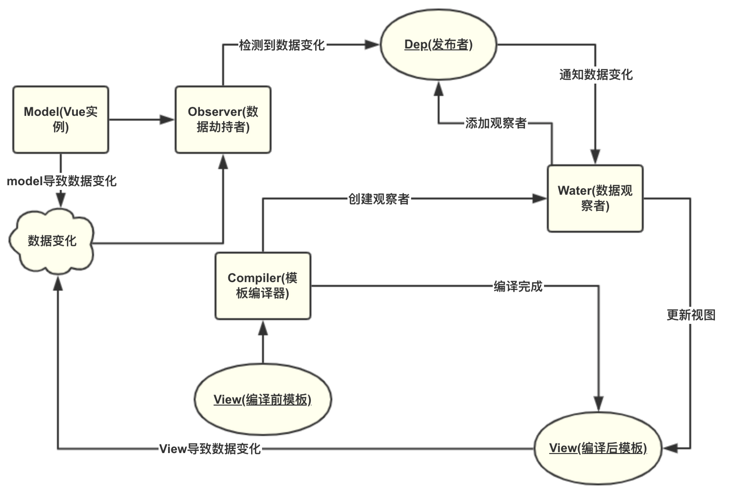
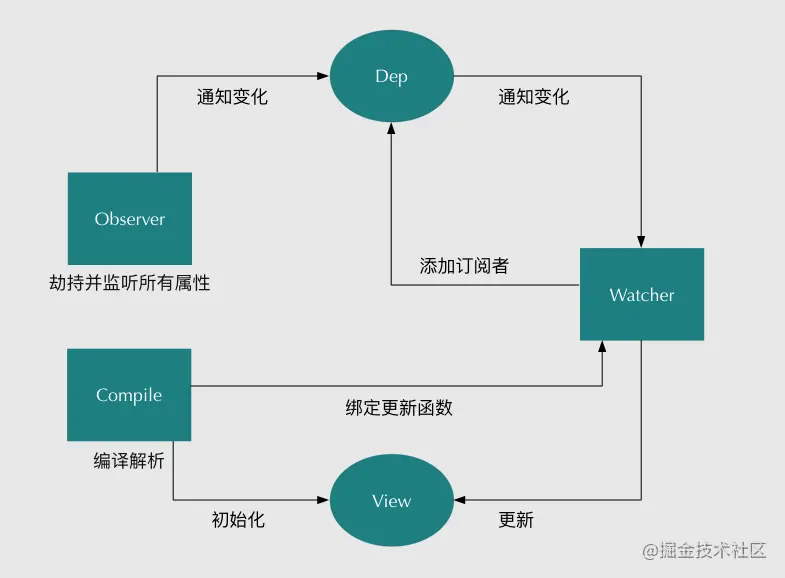

<!--
 * @Author: your name
 * @Date: 2021-12-21 11:46:13
 * @LastEditTime: 2022-01-21 00:21:27
 * @LastEditors: Please set LastEditors
 * @Description: 打开koroFileHeader查看配置 进行设置: https://github.com/OBKoro1/koro1FileHeader/wiki/%E9%85%8D%E7%BD%AE
 * @FilePath: \workspaces\plugins\面试\vue-work.md
-->
# 双向绑定原理
## 站在巨人的肩膀
[Vue数据双向绑定原理和实现](https://segmentfault.com/a/1190000021327394)
[vue 的双向绑定原理及实现](https://juejin.cn/post/6844903479044112391)
[vue 的双向绑定](https://www.kancloud.cn/webxiaoma/vue/703363)
[Vue双向绑定原理](https://blog.nowcoder.net/n/8517450fe4fd4220b4078f9c61e42ec1)
[基于数据劫持双向绑定](http://weixisheng.github.io/vue/#%E5%9F%BA%E4%BA%8E%E6%95%B0%E6%8D%AE%E5%8A%AB%E6%8C%81%E5%8F%8C%E5%90%91%E7%BB%91%E5%AE%9A)  
[Vue 双向数据绑定原理](https://zxpsuper.github.io/Demo/advanced_front_end/vue/  vue.html#_1-documentfragment)
[剖析Vue实现原理 - 如何实现双向绑定mvvm](https://github.com/DMQ/mvvm)

## 双向绑定
1. 单项绑定: 即我们将Model(也就是数据) 绑定到view (前端一般为网页) ，当我们用JavaScript代码更新Model时，View就会自动更新
2. 双向绑定: 数据模型（Module）和视图（View）之间的双向绑定, 也就是用户在视图上的修改会自动同步到数据模型中去，同样的，如果数据模型中的值发生了变化，也会立刻同步到视图中去

## vue angular
1. vue 数据劫持和发布者-订阅者模式
2. angular 脏值检查
3. 发布者-订阅者模式（backbone.js）

## vue中的双向绑定
1. Vue实现数据双向绑定主要利用的就是: 数据劫持和发布订阅模式
2. 发布订阅模式就是，定义了对象间的一种一对多的关系，让多个观察者对象同时监听某一个主题对象，当一个对象发生改变时，所有依赖于它的对象都将得到通知
3. 数据劫持，就是利用JavaScript的访问器属性，即Object.defineProperty()方法，当对对象的属性进行赋值时，Object.defineProperty就可以通过set方法劫持到数据的变化，然后通知发布者(主题对象)去通知所有观察者，观察者收到通知后，就会对视图进行更新  



### 实现Observer 监听器
1. Observer 监听器主要作用是使用 `Object.defineProperty()`来实现对属性的劫持并监听，也就是给`vue data`对象中的每一个属性添加 `getter 和 setter`, 在属性触发`get`时，添加订阅者，在触发`set`时，通知订阅者

### 实现 Dep 消息订阅器
1. Dep 消息订阅器的作用是存储所有订阅者，同时接受Observer 监听器发出的消息，接受到消息后并对订阅者做一些处理（是添加订阅者还是批量通知订阅者）

### 实现 Watcher 订阅者
Watcher 订阅者是Watcher订阅者作为Observer和Compile之间通信的桥梁，它主要的做的一些事是
1. 在自身实例化时往属性订阅器(dep)里面添加自己
2. 自身必须有一个update()方法;
3. 待属性变动dep.notice()通知时，能调用自身的update()方法，并触发Compile中绑定的回调，并更新视图

### 实现 Compile 解析器
1. Compile 解析器的作用主要是解析模板指令，将模板中的变量（如 {{ name }}）替换成数据或一些其他指令（如 v-show v-for v-if 等），然后初始化渲染页面视图，
2. 并将每个指令对应的节点绑定更新函数，添加监听数据的订阅者。
3. 这里也就是解析模板，并对模板中的每一个数据添加一个数据监听器对象(Watcher)。

### 将以上几种方法整合，暴露出接口，生成可以实例化的入口函数(如 new Vue())

## Vue 中双向数据绑定的具体实现

### Observer 监听器的实现
```JS

function defineReactive(data,key,val){
    observe(val) // 递归遍历对象
    let dep = new Dep() // 创建Dep 实例
    Object.defineProperty(data,key,{
       enumerable:true,
       configurable:true,
       set(newVal){
            if(val === newVal){
                return 
            }
            val = newVal
            dep.notify(); // 通知Dep 发布消息
       },
       get(){
           if(Dep.target){ // 判断观察者Watcher 是否存在
               dep.addSub(Dep.target) // 添加观察者
           }
           return val 
       }
    })
   
}

function observe(data){
  if(!data || typeof data !== "object"){ // 判断传入的data是否为对象
      return
  }
  Object.keys(data).forEach(key=>{ // 遍历data对象中一级属性
    defineReactive(data,key,data[key])
  }) 
}


```
```JS
class Observer {
    constructor(data) {
        this.observer(data);
    }
    observer(data) { 
        if (data &&  typeof data ===  "object") { // 如果传入的data是一个对象，遍历data对象中的所有属性改成Object.defineProperty的形式
            for (let key in data) { //有可能是继承属性，使用keys好点
                this.defineReactive(data, key, data[key]);
            }
        }
    }
    defineReactive(obj, key, value) {
        this.observer(value); // 递归观察数据,如果data中的某个属性的属性值为对象，则也要进行观察
        Object.defineProperty(obj, key, {
            get() {
                return value;
            },
            set: (newValue) => {
                if (newValue != value) {
                    this.observer(newValue); // 如果赋值的是对象那么也进行新数据监控
                    value = newValue;
                }
            }
        });
    }
}
```
### Dep 消息订阅器 实现
`Dep` 主要是收集订阅者的,并可以监听器的消息，来完成添加订阅者或是通知所有订阅者更新数据。
```JS

function Dep(){
    this.subs = []; // 存储Watcher观察者
}

Dep.prototype = {
    addSub(sub){ // 添加观察者
       this.subs.push(sub)
    },
    notify(){ // 通知相关的所有订阅者
       this.subs.forEach(watch=>{
          watch.updata();
       })
    }
}


```
```JS
// 添加Dep发布者类
class  Dep { 
    constructor() {
        this.subs  = []; // 存放所有的watcher
    }
    // 订阅
    addSub(watcher) { // 添加watcher
        this.subs.push(watcher);
    }
    // 发布，遍历所有的观察者，调用观察者的update进行页面的更新
    notify() {
        this.subs.forEach((watcher) => {
            watcher.update();
        });
    }
}

```
### Watcher 订阅者的实现
1. 关于Watcher 订阅者我们需要注意的是，除了发布的消息并及时更新视图外，
2. 他还有一个get方法，该方法的作用就是在初始化时将每一个订阅者添加到订阅器中收集起来。而触发订阅器添加（也就是触发Dep的addSub方法）观察者的方法是需要触发监听其中的get方法。也就是需要获取相应的属性值（对应上边 let value = this.vm.data[this.key] ），这时就会触发get方法，并在订阅者初始化时将自己添加到Dep 订阅器中，添加完成后通过 Dep.target = null 将Dep.target释放，下次再执行该属性下的get方法时，不会重复添该属性对应的加观察者。
3. 同时Watcher还是Compile编译器和Observer 监听者之间的桥梁，通过Watcher可以把监听后的属性和Compil编译后的模板中的数据绑定起来，并在属性值变化时，更新模板中对应的数据
```JS

function Watcher(vm,key,callback){
    this.callback = callback;  // 存储观察者的回调函数
    this.vm = vm;  // 存储入口函数的实例this
    this.key = key; 
    this.value = this.get()  // 储存所观察对象的初始值
    
}

Watcher.prototype = {
    updata(){
        this.run();
    },
    run(){
        let value = this.vm.data[this.key] //获取变化后的属性值
        let oldVal = this.value // 获取旧属性值
        if(value !== oldVal){
            this.callback(value) // 调用回调函数并传入变化后的值更新视图
        }
    },
    get(){  // 该方法可以在初始化时，将Watcher 观察者初始化并添加到订阅其中
        Dep.target = this; 

        // 获取初始值时（这是实际是获取的vue实例中data中的初始值），会触发Observer监听器中的get方法
        let value = this.vm.data[this.key]  
        Dep.target = null;// 这里释放了Wahter 防止Watcher二次添加到订阅器中
        return value;
    }
}

```
```JS
// 添加Watcher观察者类
// 添加一个CompileUtil工具对象
var CompileUtil = {
    getVal(vm, expr) { // 根据vm和指令表达式从vm中获取数据
        return  expr.split(".").reduce((data, current) => {
            return data[current];
        }, vm.$data);
    },
    model(node, expr, vm) {
        const value =  this.getVal(vm, expr); // 获取表达式的值
        node.value  = value; // 对于v-model指令，直接给DOM的value属性赋值即可
    }
}
class  Watcher {
    constructor(vm, expr, cb) {
        Dep.target  =  this; // 每次创建Watcher对象的时候，将创建的Watcher对象在获取值的时候添加到dep中
        this.vm  = vm;
        this.expr = expr;
        this.cb = cb;
        // 默认先存放旧值
        this.oldValue = this.get();
        Dep.target = null; // 添加Watcher对象后清空，防止每次获取数据的时候都添加Watcher对象
    }
    get() {
        let value =  CompileUtil.getVal(this.vm, this.expr);
        return value;
    }
    update() {
        let newValue =  CompileUtil.getVal(this.vm, this.expr);
        if (newValue !==  this.oldValue) {
            this.cb(newValue);
        }
    }
}
```
### Compile 编译器的实现
```JS

function Compile(el,vm){ 
    this.vm = vm; // 存储vue实例this
    this.el = el  // 储存dom 根节点，vue实际上并非这么简单，还做的一些其他判断，判断是否是dom节点或是字符串
    if(el){
      this.$frag = this.nodeToFragment(el) // 将DOM节点转换为fragment 虚拟节点
      this.compileElement(this.$frag)  // 编译解析模板
    }
    el.appendChild(this.$frag) // 将编译后的虚拟DOM 添加到根节点
    return this.$frag;

}

Compile.prototype = {
    nodeToFragment(node){  //建一个fragment片段，将需要解析的dom节点存入fragment片段里再进行处理(提高性能)
        let fragment = document.createDocumentFragment();
        let child  = node.firstChild
        while(child){ // 循环将DOM节点添加到fragment 虚拟节点中
            fragment.appendChild(child)
            child = node.firstChild
        }

        return fragment;
    },

   // 编译解析模板，这里只解析了{{}}这样的模板，在该方法中还可以解析v-show v-if v-for v-module 等等一些模板
    compileElement(elFrag){ 
        let reg = /\{\{(.*)\}\}/;// 解析{{}} 这里只是简单的解析{{name}},并没有处理包含js简单代码的情况
        [].slice.call(elFrag.childNodes).forEach((node)=>{
            if(node.nodeType === 3){ // 节点类型为文本text类型
                if(reg.test(node.nodeValue)){ 
                    this.compileText(node,reg.exec(node.nodeValue)[1]) 
                }

            }
        })
      
    },
    compileText(node,exp){ // 将数据初始化，并生成订阅器实例（订阅者），并更新视图
        this.updateView(node,this.vm[exp])
        new Watcher(this.vm,exp,(value)=>{ // 当数据变化时将会执行回调函数，并更新视图
            this.updateView(node,value)
        })
        
    },
    updateView(node,value){ // 更新视图
        node.textContent = typeof value == 'undefined' ? '' : value;
    }
}

```
### 入口文件的实现
```JS

function SelfVue (obj){ // 入口文件 类似 new Vue()
    this.data = obj.data
    let el = document.querySelector(obj.el)
    this.$el = el
    // 这里我们目的是将data下的数据绑定到SelfVue实例上，通过实例可以直接访问
    Object.keys(obj.data).forEach(key=>{ 
        this.proxyDataKeys(key)
    })
    observe(obj.data) // 给data中的所有属性添加get和set
    new Compile(el,this) //编译初始模块

    return this

}

/* 
将SelfVue实例data属性上的数据绑定到SelfVue实例上 
例如：
let selfVue = new SelfVue({
    el:"#root",
    data:{
        name:'King',
    },
})

我们访问name属性，需要这样访问  selfVue.data.name
将SelfVue实例data属性上的数据绑定到SelfVue实例上后就可以这样访问  selfVue.name

*/
SelfVue.prototype =  { 
     proxyDataKeys(key){
        let self = this;
        Object.defineProperty(this,key,{
            enumerable:true,
            configurable:true,
            get(){
              return self.data[key]
            },
            set(newVal){
              self.data[key] = newVal
            }

        })
     }
}

```
## 优点
1. 不需要显示的调用，Vue利用数据劫持+发布订阅，可以直接通知变化并且驱动视图
2. 直接得到精确的变化数据，劫持了属性setter，当属性值改变我们可以精确的获取变化的内容newVal，不需要额外的diff操作
## 缺点
因为Object.defineProperty有如下缺点：
对于数组
智能检测以下方法的变化
```JS
push()
pop()
shift()
unshift()
splice()
sort()
reverse()
```
Vue 不能检测以下数组的变动：不能监听数组；因为数组没有getter和setter，因为数组长度不确定，如果太长性能负担太大

1. 当你利用索引直接设置一个数组项时，例如：vm.items[indexOfItem] = newValue
2. 当你修改数组的长度时，例如：vm.items.length = newLength
vue对于对象
2. Object.defineProperty 的第二个缺陷,只能劫持对象的属性, 因此我们需要对每个对象的每个属性进行遍历，如果属性值也是对象那么需要深度遍历, 显然能劫持一个完整的对象是更好的选择
3. 只能监听属性，而不是整个对象；需要遍历属性；
4. 只能监听属性变化，不能监听属性的删减

### 3.0 proxy
ES6新方法，它可以理解成，在目标对象之前架设一层“拦截”，外界对该对象的访问，都必须先通过这层拦截，因此提供了一种机制，可以对外界的访问进行过滤和改写。
Proxy好处：
1. Proxy可以监听数组，不用单独处理数组；
2. Object.defineProperty需要指定对象和属性，对于多层嵌套的对象需要递归监听，Proxy可以直接监听整个对象，不需要递归；
3. Object.defineProperty的get方法没有传入参数，如果我们需要返回原值，需要在外部缓存一遍之前的值，Proxy的get方***传入对象和属性，可以直接在函数内部操作，不需要外部变量；
4. set方法也有类似的问题，Object.defineProperty的set方法传入参数只有newValue，也需要手动将newValue赋给外部变量，Proxy的set也会传入对象和属性，可以直接在函数内部操作；
5. new Proxy()会返回一个新对象，不会污染源原对象；
```JS
vue.prototype.observer = function(obj){
  var self = this;
  this.$data = new Proxy(this.$data, {
    get: function(target, key){
      return target[key];
    },
    set: function(target, key, newValue){
      target[key] = newValue;
      self.render();
    }
  });
}
```
2.4 Proxy缺点
兼容性不好，且无法用polyfill磨平；